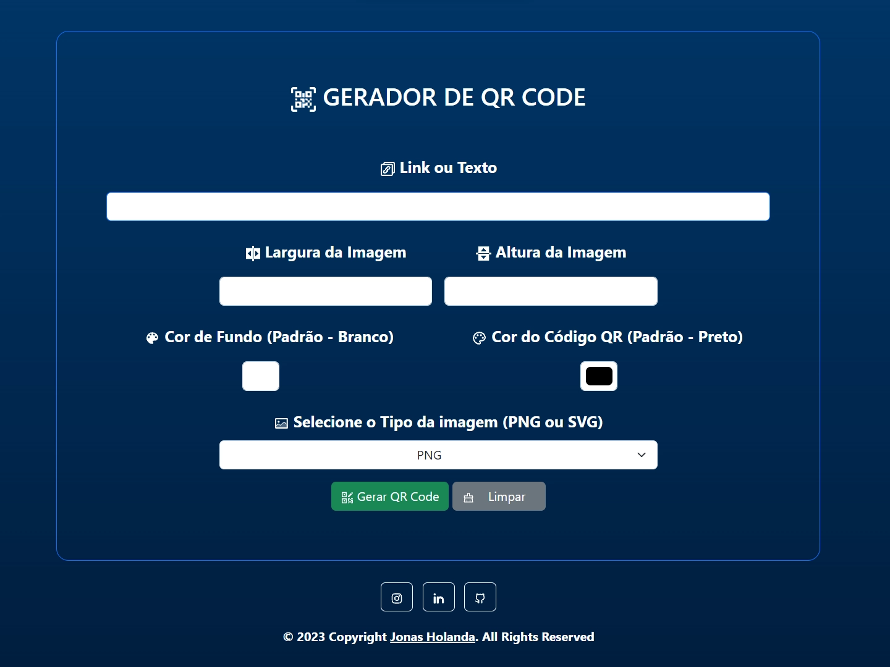
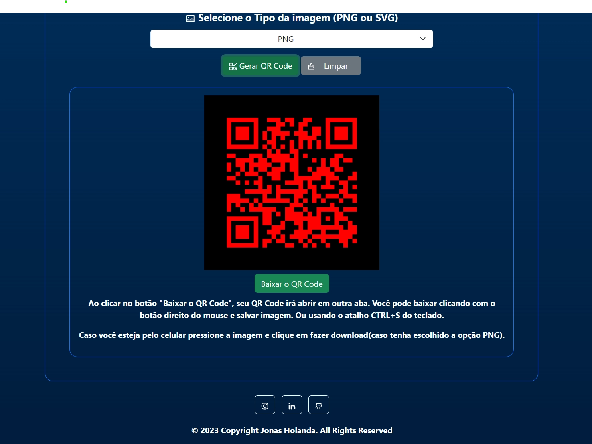

# QR Code Generator

**Este é um gerador de QR Code, que criei utilizando a API da [Image-Charts](https://documentation.image-charts.com/).**

**O Formulário recebe as informações de *Link ou Texto*, *Largura da Imagem*, *Altura da Imagem*, *Cor de Fundo*, *Cor do Código QR* e o *Tipo da Imagem(PNG OU SVG)*.**

**E utilizo o JavaScript para fazer essa ligação com a API, passando no link os dados recebidos no formulário. Retornando assim o QR Code todo personalizado com as informações obtidas no formulário.**

**Link do site:**
<a href="https://jonas-holanda.github.io/qrcode-generator/" target="_blank"><strong>https://jonas-holanda.github.io/qrcode-generator/</strong></a>

